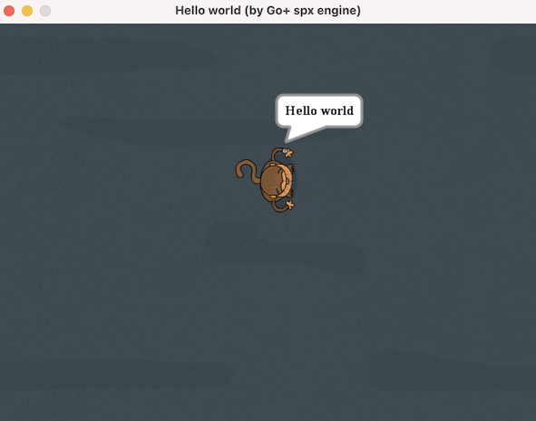

HelloWorldForSpx - Hello world of Go+ spx game engine
=========

### How to run

- Download Go+ and build it. See https://github.com/goplus/gop#how-to-build.
- Download this game and run.
  * git clone https://github.com/sunqirui1987/HelloWorldForSpx.git
  * cd HelloWorldForSpx
  * ./run.sh
